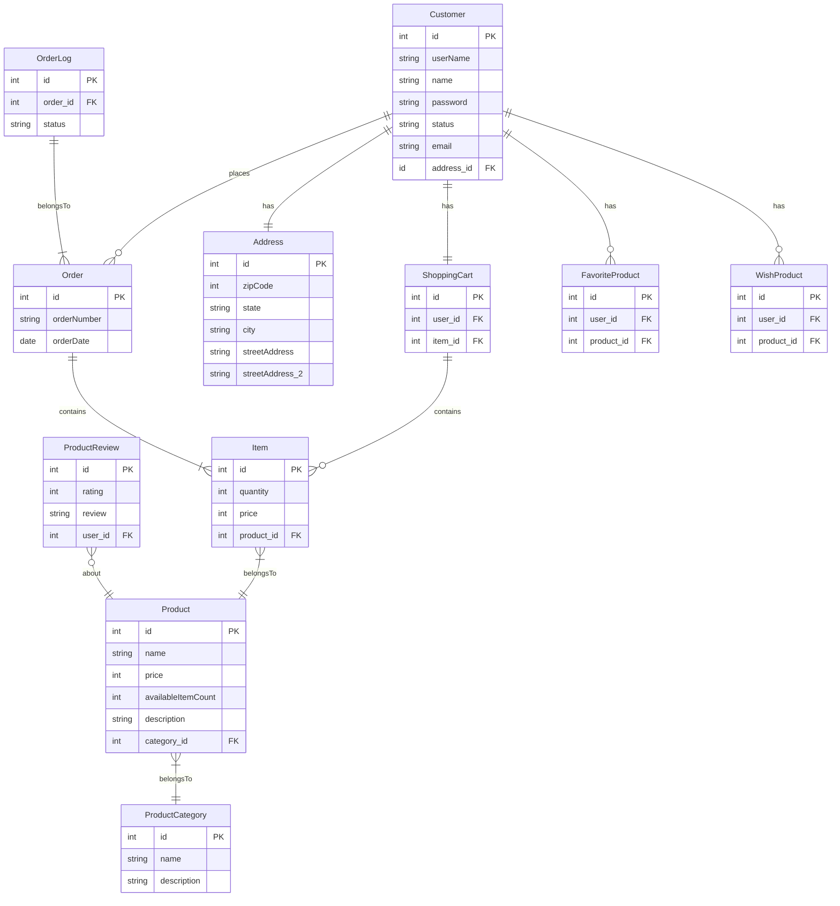

```mermaid
erDiagram
    Customer ||--|| ShoppingCart: has
    Customer ||--|| Address: has
    Customer ||--o{ Order: places
    Customer ||--o{ FavoriteProduct: has
    Customer ||--o{ WishProduct: has

    Customer{
        int id PK
        string userName
        string name
        string password
        string status
        string email
        id address_id FK
    }

    Address{
        int id PK
        int zipCode
        string state
        string city
        string streetAddress
        string streetAddress_2

    }

    ShoppingCart ||--o{ Item: contains
    ShoppingCart{
        int id PK
        int user_id FK
        int item_id FK
    }

    Product |{--|| ProductCategory: belongsTo
    Product{
        int id PK
        string name
        int price
        int availableItemCount
        string description
        int category_id FK
    }

    Item |{--|| Product: belongsTo
    Item{
        int id PK
        int quantity
        int price
        int product_id FK
    }

    Order ||--|{ Item: contains
    Order{
        int id PK
        string orderNumber
        date orderDate
    }

    ProductCategory{
        int id PK
        string name
        string description
    }

    OrderLog ||--|{ Order: belongsTo
    OrderLog{
        int id PK
        int order_id FK
        string status
    }

    ProductReview }o--|| Product: about
    ProductReview{
        int id PK
        int rating
        string review
        int user_id FK
    }

    FavoriteProduct{
        int id PK
        int user_id FK
        int product_id FK
    }

    WishProduct{
        int id PK
        int user_id FK
        int product_id FK
    }


```
